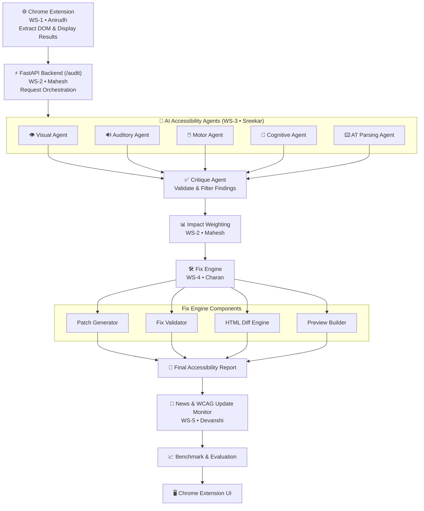

<div align="center">

# 🚀 AccessAI

### AI-Powered Web Accessibility Auditing Platform

An AI-powered accessibility auditing platform that evaluates websites for **WCAG (Web Content Accessibility Guidelines)** compliance using a **multi-agent AI architecture**. The system detects accessibility issues, validates findings, generates compliant fixes, and presents an interactive accessibility report through a Chrome Extension.

[](https://www.python.org/)
[](https://fastapi.tiangolo.com/)
[](https://developer.chrome.com/docs/extensions/)
[](https://www.w3.org/WAI/standards-guidelines/wcag/)
[](https://pytest.org)
[](#-license)

</div>

---

## 📑 Table of Contents

- [Overview](#-overview)
- [System Architecture](#️-system-architecture)
- [Repository Structure](#-repository-structure)
- [Project Workflow](#-project-workflow)
- [Data Contracts](#-data-contracts)
- [Technology Stack](#️-technology-stack)
- [Team Responsibilities](#-team-responsibilities)
- [Key Features](#-key-features)
- [Getting Started](#-getting-started)
- [API Usage](#-api-usage)
- [Testing](#-testing)
- [Git Workflow & Contribution Guide](#-git-workflow--contribution-guide)
- [Contract Change Protocol](#-contract-change-protocol)
- [License](#-license)

---

## 🌐 Overview

AccessAI closes the gap between automated accessibility scanners (which flag issues) and real remediation (which fixes them). Where tools like axe-core or Lighthouse stop at "here's a violation," AccessAI continues the pipeline all the way to a **validated, ready-to-apply code patch** — reviewed by a critique agent for accuracy, re-tested against the real WCAG rule engine, and presented as a diff with a live preview.

---

## 🏗️ System Architecture



---

## 📂 Repository Structure

```text
AccessAI/
│
├── extension/
│   ├── manifest.json
│   ├── background.js
│   ├── content_script.js
│   ├── assets/
│   └── side_panel/
│       ├── panel.html
│       ├── panel.css
│       └── panel.js
│
├── backend/
│   ├── main.py
│   ├── requirements.txt
│   │
│   ├── orchestrator/
│   │   ├── __init__.py
│   │   ├── pipeline.py
│   │   └── contracts.py
│   │
│   ├── agents/
│   │   ├── visual_agent.py
│   │   ├── auditory_agent.py
│   │   ├── motor_agent.py
│   │   ├── cognitive_agent.py
│   │   ├── at_parsing_agent.py
│   │   └── critique_agent.py
│   │
│   ├── rag/
│   │   ├── vector_store.py
│   │   └── wcag_loader.py
│   │
│   ├── fix_engine/
│   │   ├── patch_generator.py
│   │   ├── fix_validator.py
│   │   └── diff_engine.py
│   │
│   ├── news/
│   │   ├── aggregator.py
│   │   └── summariser.py
│   │
│   └── evaluation/
│       ├── benchmark.py
│       └── wcag_update_monitor.py
│
├── data/
│   ├── wcag_criteria.json
│   └── regulation_mapping.csv
│
├── docs/
│
├── tests/
│
├── README.md
└── .gitignore
```

Folder ownership is the team's merge-conflict prevention strategy: each workstream owns one folder exclusively, and the five pieces integrate only through fixed JSON contracts — never by editing each other's files.

---

## 🔄 Project Workflow

### 1. Chrome Extension — `extension/` (WS-1 • Anirudh)

- Captures the page DOM, computed styles, and tab order via a content script
- Redacts PII client-side before anything leaves the browser
- Sends the DOM Payload to the backend `/audit` endpoint
- Renders the final report: Audit findings, Fix Studio (diff + preview), Benchmark, News, and Timeline tabs

### 2. Backend Orchestrator — `backend/orchestrator/` (WS-2 • Mahesh)

- FastAPI service exposing `POST /audit`
- Runs the 7-step pipeline: DOM chunking → rule-based pre-scan (axe-core) → parallel agent dispatch → critique verification → impact weighting → fix generation → report assembly
- Owns `contracts.py`, the single source of truth for every JSON shape shared between workstreams

### 3. AI Accessibility Agents & RAG — `backend/agents/`, `backend/rag/` (WS-3 • Sreekar)

Five disability-specialist agents run in parallel via `asyncio.gather`, each grounded in the lived experience of its disability class rather than a mechanical checklist:

| Agent | Focus |
|---|---|
| 👁️ Visual | Alt text quality, contrast ratios, focus indicators |
| 🔊 Auditory | Captions, transcripts, audio descriptions |
| 🖱️ Motor | Keyboard traps, touch target size, tab order |
| 🧠 Cognitive | Reading level, form grouping, error prevention |
| ⌨️ AT Parsing | Heading hierarchy, ARIA landmarks, semantic structure |

Every finding then passes through the **Critique Agent**, which issues a `CONFIRMED` / `REJECTED` / `NEEDS_CONTEXT` verdict. A finding with no verbatim WCAG citation is rejected — no exceptions.

### 4. Impact Weighting — `backend/orchestrator/pipeline.py` (WS-2 • Mahesh)

Confirmed findings are scored by real-world impact, not just WCAG conformance level, using an affected-population-weighted formula combining severity, confidence, and criterion priority.

### 5. Fix Engine — `backend/fix_engine/` (WS-4 • Charan)

Turns every confirmed finding into a validated, ready-to-apply code fix.

| Component | Responsibility |
|---|---|
| **Patch Generator** | Few-shot LLM prompting generates candidate HTML fixes; ambiguous cases (e.g. decorative vs. informational images) always return both options plus a recommendation — never a silent guess |
| **Fix Validator** | Re-runs axe-core against the patch; retries up to 2 times with the error fed back into the prompt; falls back to `requires_human_review` rather than looping or lying about success |
| **HTML Diff Engine** | Token-level diff (attribute-level precision, no whitespace noise), rendered as a standard unified diff |
| **Preview Builder** | Builds a self-contained, sandboxed `srcdoc` with the patched element highlighted |

### 6. News & Evaluation — `backend/news/`, `backend/evaluation/` (WS-5 • Devanshi)

- Aggregates WCAG-related legal decisions, enforcement actions, and guideline updates from CourtListener, W3C, and DOJ/EEOC sources
- Monitors the live WCAG spec for changes, queuing new criteria for human review rather than auto-applying them
- Benchmarks AccessAI's findings against axe-core, WAVE, and Lighthouse on a fixed, pre-committed URL set

---

## 📜 Data Contracts

Three JSON contracts, defined in `backend/orchestrator/contracts.py`, are what let five people build in parallel without touching each other's code.

**DOM Payload** (Extension → Orchestrator):
```json
{
  "url": "https://example.com",
  "timestamp": "2026-07-02T10:30:00Z",
  "dom_html": "<html>...</html>",
  "computed_styles": { "button.submit": { "color": "#fff", "background-color": "#000" } },
  "meta": { "spa_detected": false, "dom_size_bytes": 45200, "page_title": "Example Domain", "lang_attribute": "en" }
}
```

**Finding Object** (Agents → Critique → Fix Engine):
```json
{
  "id": "uuid-string",
  "disability_class": "visual",
  "criterion_number": "1.4.3",
  "criterion_level": "AA",
  "criterion_text": "verbatim WCAG text from vector store",
  "legal_regulations": ["ADA Title III", "EAA Article 4"],
  "finding_description": "plain English description",
  "disability_impact": "impact on AT user",
  "element_selector": "img.hero-banner",
  "confidence": 0.92,
  "status": "confirmed",
  "critique_verdict": "CONFIRMED",
  "critique_citation": "verbatim criterion text",
  "impact_score": 78
}
```

**Report JSON** (Orchestrator → Extension):
```json
{
  "audit_metadata": { "url": "", "timestamp": "", "wcag_version": "", "spa_detected": false },
  "findings": ["...FINDING_OBJECT with fix appended..."],
  "finding.fix": {
    "patch_html": "",
    "patch_validated": true,
    "diff_html": "",
    "preview_srcdoc": "",
    "requires_human_review": false,
    "review_reason": null
  },
  "benchmark": { "axe_findings": 12, "wave_findings": 18, "our_findings": 9, "unique": 3 },
  "news_preview": [{ "headline": "", "summary": "", "wcag_tags": "", "date": "" }],
  "disclaimer": "standard disclaimer text"
}
```

---

## 🛠️ Technology Stack

| Layer | Technologies |
|---|---|
| **Backend** | Python, FastAPI |
| **AI / ML** | LLMs, multi-agent orchestration, Retrieval-Augmented Generation (ChromaDB + BGE embeddings) |
| **Accessibility Engine** | axe-core, Playwright (headless browser validation) |
| **Frontend** | Chrome Extension (Manifest V3), HTML, CSS, JavaScript |
| **Testing** | Pytest |
| **Version Control** | Git, GitHub |

---

## 👥 Team Responsibilities

| Workstream | Owner | Responsibility | Branch |
|---|---|---|---|
| WS-1 | Anirudh | Chrome Extension | `feature/extension-frontend` |
| WS-2 | Mahesh | Backend Orchestrator & Impact Weighting | `feature/backend-orchestrator` |
| WS-3 | Sreekar (Lead) | AI Agents, RAG & Critique Agent | `feature/ai-agents-rag` |
| WS-4 | Charan | Fix Engine | `feature/backend-fix_engine` |
| WS-5 | Devanshi | News & Evaluation | `feature/news-evaluation` |

---

## ✨ Key Features

- WCAG 2.x accessibility auditing across five disability-specialist dimensions
- Multi-agent AI architecture with citation-gated critique verification
- Retrieval-Augmented Generation over the live WCAG criteria corpus
- Automated, axe-core-validated accessibility fix generation
- Token-level HTML diff visualization and sandboxed live preview
- Impact-weighted severity scoring, not just raw WCAG conformance level
- Benchmark comparison against axe-core, WAVE, and Lighthouse
- Chrome Extension side-panel UI with 5 dedicated report tabs
- Modular, folder-owned backend architecture with zero cross-team file conflicts
- Full Pytest coverage per workstream

---

## 🚀 Getting Started

**1. Clone the repository**
```bash
git clone https://github.com/sreeks7675/AccessAI.git
cd AccessAI
```

**2. Create a virtual environment**
```bash
python -m venv venv
source venv/bin/activate        # macOS/Linux
venv\Scripts\activate           # Windows
```

**3. Install dependencies**
```bash
pip install -r backend/requirements.txt
```

**4. Configure environment variables**

Create a `.env` file in the project root:
```bash
VLLM_ENDPOINT=http://localhost:8000
AXE_SIDECAR_URL=http://localhost:8090
```

**5. Run the backend**
```bash
python backend/main.py
```

**6. Load the Chrome Extension**

Go to `chrome://extensions`, enable Developer Mode, click **Load Unpacked**, and select the `extension/` folder.

---

## 📡 API Usage

**Run an audit:**
```bash
curl -X POST http://localhost:8000/audit \
  -H "Content-Type: application/json" \
  -d '{
        "url": "https://example.com",
        "timestamp": "2026-07-07T10:30:00Z",
        "dom_html": "<html>...</html>",
        "computed_styles": {},
        "meta": { "spa_detected": false, "dom_size_bytes": 12000, "page_title": "Example", "lang_attribute": "en" }
      }'
```

**Call the Fix Engine directly (Python):**
```python
from backend.fix_engine import FixEnginePipeline, FindingObject

finding = FindingObject(
    id="f-001",
    disability_class="visual",
    criterion_number="1.1.1",
    criterion_level="A",
    criterion_text="Non-text Content",
    legal_regulations=["ADA Title III"],
    finding_description="img element is missing alt text",
    disability_impact="Screen reader users cannot determine the image's purpose",
    element_selector="img.hero-banner",
    confidence=0.95,
    status="confirmed",
    critique_verdict="CONFIRMED",
    critique_citation="Non-text Content",
    impact_score=78,
    violation_type="missing_alt_text",
)

pipeline = FixEnginePipeline()
fix = pipeline.run(finding, "")

print(fix.patch_html)        # patched HTML
print(fix.patch_validated)   # True/False
print(fix.diff_html)         # unified diff
```

---

## 🧪 Testing

**Run the full suite:**
```bash
pytest
```

**Run a single workstream's tests:**
```bash
pytest tests/test_fix_engine -v          # WS-4 • Charan
pytest tests/test_orchestrator -v        # WS-2 • Mahesh
pytest tests/test_agents -v              # WS-3 • Sreekar
pytest tests/test_extension -v           # WS-1 • Anirudh
pytest tests/test_news_eval -v           # WS-5 • Devanshi
```

**Run with coverage:**
```bash
pytest --cov=backend tests/
```

---

## 🌱 Git Workflow & Contribution Guide

1. **Pull before you start.** Every morning, before opening any file:
   ```bash
   git checkout feature/<your-branch>
   git fetch origin
   git pull origin main
   git push origin feature/<your-branch>
   ```
2. **Commit with a workstream prefix**, so `git log` shows exactly which workstream introduced a change:
   ```bash
   git commit -m "[WS-4] Add fix validation loop with axe-core re-run"
   ```
3. **Open a PR only when a feature is complete and tested** — not on every commit. Base = `main`, Compare = your feature branch.
4. **Only Sreekar (team lead) merges PRs**; Mahesh is backup merger.
5. **A merge conflict outside your own folder is a signal to stop**, not to resolve manually — it means a branch was pulled from the wrong place.

---

## 📝 Contract Change Protocol

If any of the three shared JSON contracts needs to change:

1. Post `CONTRACT CHANGE PROPOSED: <description>` in the group chat, tagging everyone who produces or consumes that contract.
2. Wait for Sreekar's approval.
3. Mahesh updates `backend/orchestrator/contracts.py` and notifies the team.
4. Everyone pulls `main` and updates their code to match.

No one changes a shared field shape silently — a silent rename breaks whoever's on the other end of that contract without warning.

---

## 📄 License

This project is developed for educational and research purposes as part of the **AccessAI** accessibility auditing platform.
