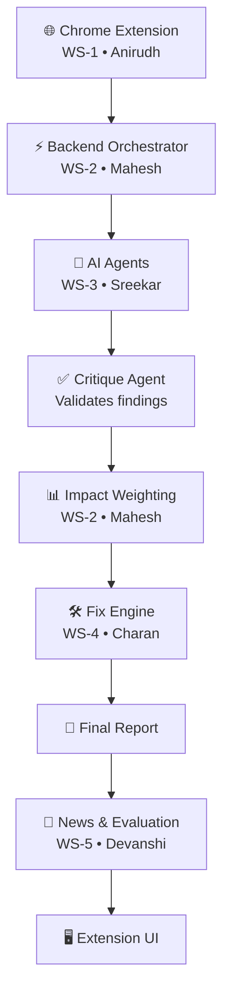

<div align="center">

# 🚀 AccessAI

**AI-Powered Web Accessibility Auditing Platform**

An AI system that audits websites for WCAG accessibility compliance, then generates and validates real code fixes — all delivered through a Chrome Extension.

</div>

---

## Overview

Most accessibility tools stop at "here's a problem." AccessAI goes further.

It uses five specialist AI agents to find violations, a critique agent to verify each one against real WCAG text, and a fix engine that generates, validates, and previews an actual code patch — ready to apply.

---

## System Architecture



---

## Repository Structure

```text
AccessAI/
├── extension/          Chrome Extension          (WS-1 • Anirudh)
├── backend/
│   ├── orchestrator/   Pipeline + contracts       (WS-2 • Mahesh)
│   ├── agents/         5 disability agents        (WS-3 • Sreekar)
│   ├── rag/            WCAG knowledge base         (WS-3 • Sreekar)
│   ├── fix_engine/     Patch + validate + diff     (WS-4 • Charan)
│   ├── news/           News aggregator             (WS-5 • Devanshi)
│   └── evaluation/     Benchmarks + updates        (WS-5 • Devanshi)
├── data/                Shared WCAG data
├── tests/               One folder per workstream
└── README.md
```

Each workstream owns one folder. No one edits another person's folder — that's how five people avoid merge conflicts.

---

## Team

| Workstream | Owner | Branch |
|---|---|---|
| Extension Frontend | Anirudh | `feature/extension-frontend` |
| Backend Orchestrator | Mahesh | `feature/backend-orchestrator` |
| AI Agents & RAG | Sreekar (Lead) | `feature/ai-agents-rag` |
| Fix Engine | Charan | `feature/backend-fix_engine` |
| News & Evaluation | Devanshi | `feature/news-evaluation` |

---

## How It Works

**1. Extension captures the page**
Reads the DOM, styles, and tab order. Strips out anything sensitive before sending it anywhere.

**2. Backend runs the pipeline**
Chunks the page, runs a quick rule-based scan, then hands off to the AI agents.

**3. Five agents check for violations**
Visual, Auditory, Motor, Cognitive, and Screen Reader agents each check their own area, in parallel.

**4. Critique agent verifies every finding**
No verbatim WCAG citation, no finding. This is what keeps results trustworthy.

**5. Fix Engine generates a real patch**
Produces the fix, re-tests it with axe-core, and only returns it once it actually passes.

**6. Report goes back to the extension**
Shown as a diff, a live preview, and a plain-language explanation.

---

## Getting Started

```bash
# Clone the repo
git clone https://github.com/sreeks7675/AccessAI.git
cd AccessAI

# Set up a virtual environment
python -m venv venv
source venv/bin/activate      # Windows: venv\Scripts\activate

# Install dependencies
pip install -r backend/requirements.txt

# Run the backend
python backend/main.py
```

Then load the extension: go to `chrome://extensions`, enable Developer Mode, click **Load Unpacked**, and select the `extension/` folder.

---

## Testing

```bash
# Run everything
pytest

# Run just one workstream
pytest tests/test_fix_engine -v
```

---

## Git Workflow

**Every morning:**
```bash
git checkout feature/<your-branch>
git pull origin main
```

**Commit format:**
```bash
git commit -m "[WS-4] Add fix validation loop"
```

**Opening a PR:** only when a feature is complete, not on every commit. Sreekar merges; Mahesh is backup.

---

## Changing a Shared Contract

If the data shared between workstreams needs to change:

1. Post in group chat: `CONTRACT CHANGE PROPOSED: <what and why>`
2. Wait for Sreekar's approval
3. Mahesh updates the contract and notifies everyone
4. Everyone pulls and updates their code

No silent changes — a quiet rename breaks someone else's code without warning.

---

## Tech Stack

Python · FastAPI · LLMs · RAG (ChromaDB) · axe-core · Playwright · Chrome Extension (Manifest V3) · Pytest

---

<div align="center">

Built for educational and research purposes as part of the AccessAI accessibility auditing platform.

</div>
