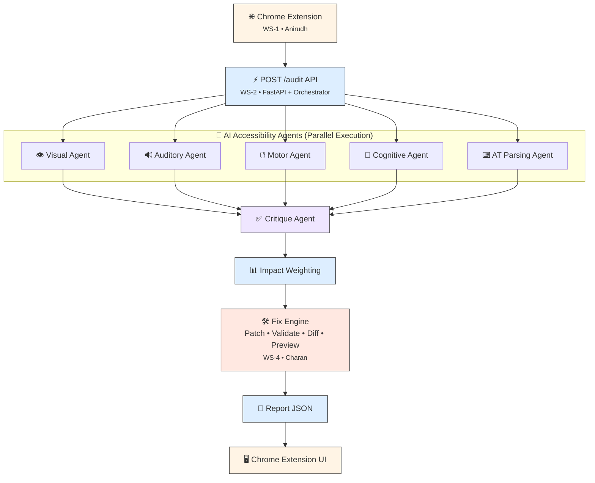

# AccessAI

An AI-powered accessibility auditing platform that analyzes web pages for **WCAG (Web Content Accessibility Guidelines)** compliance using a multi-agent AI architecture. The system automatically detects accessibility issues, generates compliant fixes, validates them, creates visual HTML diffs, and presents the results through a Chrome Extension.

---

# Project Architecture



---

# Repository Structure

```
AccessAI/
│
├── extension/
│   ├── manifest.json
│   ├── background.js
│   ├── content_script.js
│   └── side_panel/
│
├── backend/
│   ├── main.py
│   ├── orchestrator/
│   ├── agents/
│   ├── rag/
│   ├── fix_engine/
│   ├── news/
│   └── evaluation/
│
├── data/
│
├── docs/
│
├── tests/
│
├── requirements.txt
│
└── README.md
```

---

# Workflow

### 1. Chrome Extension (WS-1)

**Owner:** Anirudh

- Extracts webpage DOM
- Sends webpage content to backend
- Displays accessibility report
- Shows generated accessibility fixes

---

### 2. Backend Orchestrator (WS-2)

**Owner:** Mahesh

Responsibilities:

- FastAPI server
- `/audit` API endpoint
- Coordinates complete audit pipeline
- Executes all modules
- Generates final report JSON

---

### 3. AI Accessibility Agents (WS-3)

**Owner:** Sreekar

Five specialized agents analyze the webpage simultaneously.

- 👁️ Visual Agent
- 🔊 Auditory Agent
- 🖱️ Motor Agent
- 🧠 Cognitive Agent
- ⌨️ AT Parsing Agent

Each agent performs WCAG-based accessibility analysis and generates findings.

---

### 4. Critique Agent

Reviews all findings from the accessibility agents.

Responsibilities:

- Validate findings
- Remove duplicates
- Reject incorrect issues
- Produce final accessibility findings

---

### 5. Impact Weighting (WS-2)

**Owner:** Mahesh

Assigns severity scores based on:

- WCAG priority
- User impact
- Accessibility risk
- Overall confidence

---

### 6. Fix Engine (WS-4)

**Owner:** Charan

Automatically repairs detected accessibility issues.

Components:

- Patch Generator
- Fix Validator
- HTML Diff Engine
- Preview Builder

Features:

- Generate HTML patches
- Validate generated fixes
- Produce token-level HTML diffs
- Build accessibility preview
- Return structured fix objects

---

### 7. News & Evaluation (WS-5)

**Owner:** Devanshi

Responsibilities:

- Accessibility news aggregation
- WCAG update monitoring
- Benchmark evaluation
- Performance reporting

---

# Technology Stack

## Backend

- Python
- FastAPI

## Artificial Intelligence

- Large Language Models (LLMs)
- Multi-Agent Architecture
- Retrieval-Augmented Generation (RAG)

## Frontend

- Chrome Extension API
- HTML
- CSS
- JavaScript

## Testing

- Pytest

## Version Control

- Git
- GitHub

---

# Team Responsibilities

| Workstream | Owner | Responsibility |
|------------|--------|----------------|
| WS-1 | Anirudh | Chrome Extension |
| WS-2 | Mahesh | Backend Orchestrator & Impact Weighting |
| WS-3 | Sreekar | AI Agents, RAG & Critique Agent |
| WS-4 | Charan | Fix Engine |
| WS-5 | Devanshi | News & Evaluation |

---

# Fix Engine (WS-4)

The Fix Engine receives validated accessibility findings and automatically generates standards-compliant fixes.

Modules:

- Patch Generator
- Fix Validator
- HTML Diff Engine
- Preview Builder

Outputs:

- HTML Patch
- Validated Fix
- HTML Diff
- Preview HTML
- Review Status

---

# Features

- WCAG Accessibility Auditing
- Multi-Agent AI Architecture
- Automated Accessibility Fix Generation
- Patch Validation
- HTML Token-Level Diff Generation
- Accessibility Preview
- Severity Scoring
- Browser Extension Integration
- Modular Backend Architecture
- Automated Testing using Pytest

---

# Testing

Run all tests:

```bash
pytest
```

Run only Fix Engine tests:

```bash
pytest backend/tests/test_fix_engine -v
```

---

# Getting Started

Clone the repository

```bash
git clone https://github.com/sreeks7675/AccessAI.git
```

Install dependencies

```bash
pip install -r backend/requirements.txt
```

Run the backend

```bash
python backend/main.py
```

---

# License

This project is developed for educational and research purposes as part of the AccessAI accessibility auditing system.
