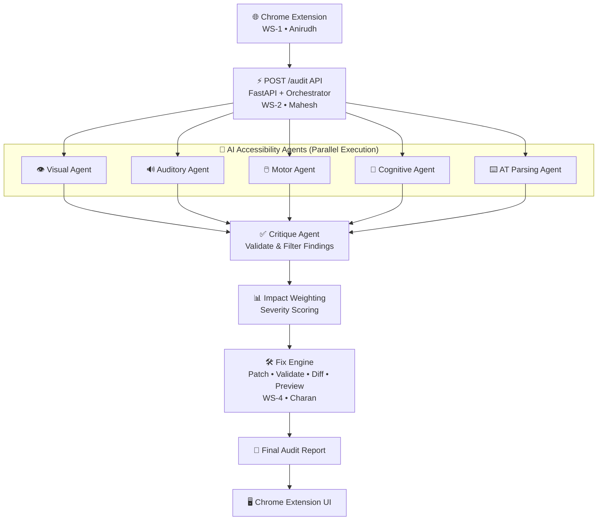

# 🚀 AccessAI

An AI-powered accessibility auditing platform that analyzes web pages for **WCAG (Web Content Accessibility Guidelines)** compliance using a **multi-agent AI architecture**.

AccessAI automatically detects accessibility issues, validates findings, generates accessibility fixes, creates HTML diffs and previews, and presents the final accessibility report through a Chrome Extension.

---

# 🏗️ System Architecture



---

# 📁 Repository Structure

```text
AccessAI/
│
├── extension/
│   ├── manifest.json
│   ├── background.js
│   ├── content_script.js
│   ├── assets/
│   └── side_panel/
│       ├── panel.html
│       ├── panel.css
│       └── panel.js
│
├── backend/
│   ├── main.py
│   ├── requirements.txt
│   │
│   ├── orchestrator/
│   │   ├── __init__.py
│   │   ├── pipeline.py
│   │   └── contracts.py
│   │
│   ├── agents/
│   │   ├── visual_agent.py
│   │   ├── auditory_agent.py
│   │   ├── motor_agent.py
│   │   ├── cognitive_agent.py
│   │   ├── at_parsing_agent.py
│   │   └── critique_agent.py
│   │
│   ├── rag/
│   │   ├── vector_store.py
│   │   └── wcag_loader.py
│   │
│   ├── fix_engine/
│   │   ├── patch_generator.py
│   │   ├── fix_validator.py
│   │   └── diff_engine.py
│   │
│   ├── news/
│   │   ├── aggregator.py
│   │   └── summariser.py
│   │
│   └── evaluation/
│       ├── benchmark.py
│       └── wcag_update_monitor.py
│
├── data/
│   ├── wcag_criteria.json
│   └── regulation_mapping.csv
│
├── tests/
│
├── docs/
│
├── README.md
└── .gitignore
```

---

# 🔄 Project Workflow

### 1. Chrome Extension (WS-1)

**Owner:** Anirudh

Responsibilities

- Capture webpage DOM
- Send webpage information to backend
- Display accessibility findings
- Show generated accessibility fixes

---

### 2. Backend Orchestrator (WS-2)

**Owner:** Mahesh

Responsibilities

- FastAPI backend
- `/audit` endpoint
- Coordinate complete pipeline
- Execute all modules
- Assemble final accessibility report

---

### 3. AI Accessibility Agents (WS-3)

**Owner:** Sreekar

Five specialized AI agents execute in parallel.

- 👁️ Visual Agent
- 🔊 Auditory Agent
- 🖱️ Motor Agent
- 🧠 Cognitive Agent
- ⌨️ AT Parsing Agent

Each agent analyzes the webpage using WCAG standards and produces accessibility findings.

---

### 4. Critique Agent

**Owner:** Sreekar

Responsibilities

- Validate findings
- Remove duplicate issues
- Reject false positives
- Produce verified accessibility findings

---

### 5. Impact Weighting (WS-2)

**Owner:** Mahesh

Calculates issue severity based on:

- WCAG Priority
- User Impact
- Accessibility Risk
- Confidence Score

---

### 6. Fix Engine (WS-4)

**Owner:** Charan

Automatically generates accessibility fixes.

Components

- Patch Generator
- Fix Validator
- HTML Diff Engine
- Preview Builder

Outputs

- HTML Patch
- Validated Fix
- HTML Difference
- Preview HTML
- Review Status

---

### 7. News & Evaluation (WS-5)

**Owner:** Devanshi

Responsibilities

- Accessibility news aggregation
- WCAG update monitoring
- Benchmark evaluation
- Performance reporting

---

# 🛠️ Technology Stack

### Backend

- Python
- FastAPI

### Artificial Intelligence

- Large Language Models (LLMs)
- Multi-Agent Architecture
- Retrieval-Augmented Generation (RAG)

### Frontend

- Chrome Extension API
- HTML
- CSS
- JavaScript

### Testing

- Pytest

### Version Control

- Git
- GitHub

---

# 👥 Team Responsibilities

| Workstream | Owner | Responsibility |
|------------|--------|----------------|
| WS-1 | Anirudh | Chrome Extension |
| WS-2 | Mahesh | Backend Orchestrator & Impact Weighting |
| WS-3 | Sreekar | AI Agents, RAG & Critique Agent |
| WS-4 | Charan | Fix Engine |
| WS-5 | Devanshi | News & Evaluation |

---

# 🛠️ Fix Engine (WS-4)

The Fix Engine automatically repairs accessibility issues identified during auditing.

### Modules

- Patch Generator
- Fix Validator
- HTML Diff Engine
- Preview Builder

### Features

- Automatic Fix Generation
- HTML Validation
- Token-Level HTML Diff
- Accessibility Preview
- Structured Fix Objects

---

# ✨ Key Features

- WCAG 2.x Accessibility Auditing
- Multi-Agent AI Architecture
- Automatic Accessibility Fix Generation
- HTML Patch Validation
- HTML Difference Visualization
- Accessibility Preview Generation
- Severity Scoring
- Chrome Extension Integration
- Modular Backend Design
- Automated Testing using Pytest

---

# 🧪 Testing

Run all tests

```bash
pytest
```

Run only Fix Engine tests

```bash
pytest backend/tests/test_fix_engine -v
```

---

# 🚀 Getting Started

Clone the repository

```bash
git clone https://github.com/sreeks7675/AccessAI.git
```

Navigate to the project

```bash
cd AccessAI
```

Install dependencies

```bash
pip install -r backend/requirements.txt
```

Run the backend server

```bash
python backend/main.py
```

---

# 📜 License

This project is developed for educational and research purposes as part of the **AccessAI** accessibility auditing platform.
