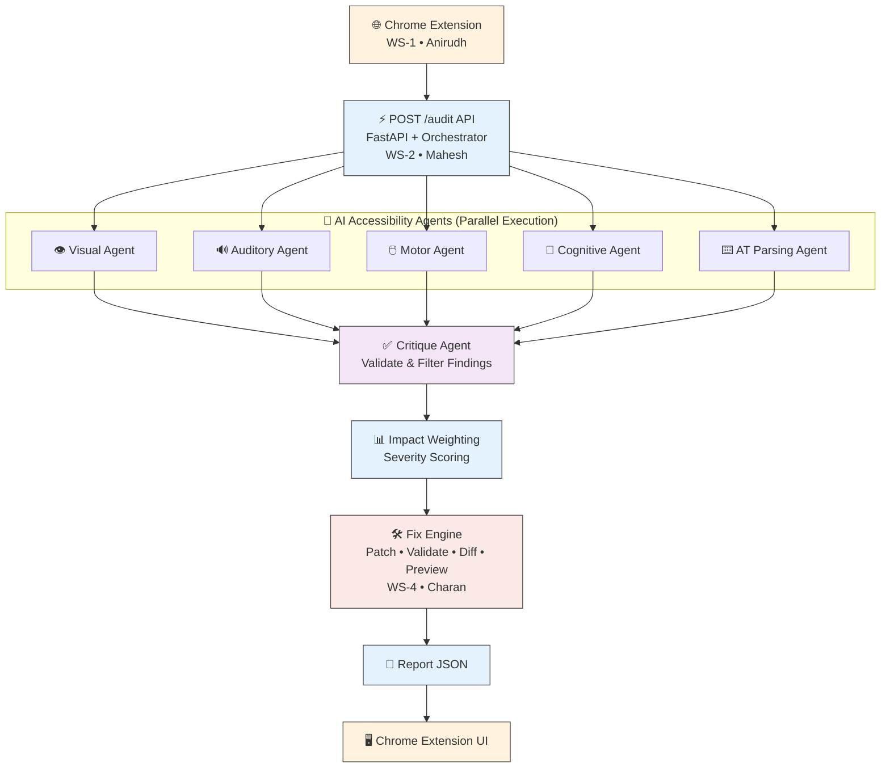

# 🚀 AccessAI

An AI-powered accessibility auditing platform that evaluates web pages for **WCAG (Web Content Accessibility Guidelines)** compliance using a **multi-agent AI architecture**.

AccessAI automatically detects accessibility issues, validates findings, generates accessibility fixes, creates HTML diffs and previews, and presents the final report through a Chrome Extension.

---

# 🏗️ System Architecture



---

# 📁 Repository Structure

```text
AccessAI/
│
├── extension/
│   ├── manifest.json
│   ├── background.js
│   ├── content_script.js
│   └── side_panel/
│
├── backend/
│   ├── main.py
│   ├── orchestrator/
│   ├── agents/
│   ├── rag/
│   ├── fix_engine/
│   ├── news/
│   └── evaluation/
│
├── data/
│
├── docs/
│
├── tests/
│
├── requirements.txt
│
└── README.md
```

---

# 🔄 Workflow

## 1️⃣ Chrome Extension (WS-1)

**Owner:** Anirudh

Responsibilities:

- Capture webpage DOM
- Send webpage to backend
- Display audit report
- Show accessibility fixes

---

## 2️⃣ Backend Orchestrator (WS-2)

**Owner:** Mahesh

Responsibilities:

- FastAPI server
- `/audit` API
- Manage audit workflow
- Coordinate all modules
- Generate final Report JSON

---

## 3️⃣ AI Accessibility Agents (WS-3)

**Owner:** Sreekar

Five specialized agents execute in parallel.

- 👁️ Visual Agent
- 🔊 Auditory Agent
- 🖱️ Motor Agent
- 🧠 Cognitive Agent
- ⌨️ AT Parsing Agent

Each agent analyzes the webpage using WCAG guidelines and generates accessibility findings.

---

## 4️⃣ Critique Agent

**Owner:** Sreekar

Responsibilities:

- Validate findings
- Remove duplicates
- Reject false positives
- Produce final findings

---

## 5️⃣ Impact Weighting (WS-2)

**Owner:** Mahesh

Assigns severity scores using:

- WCAG Priority
- User Impact
- Accessibility Risk
- Confidence Score

---

## 6️⃣ Fix Engine (WS-4)

**Owner:** Charan

Automatically generates accessibility fixes.

### Components

- Patch Generator
- Fix Validator
- HTML Diff Engine
- Preview Builder

### Outputs

- HTML Patch
- Validated Fix
- HTML Diff
- Preview HTML
- Review Status

---

## 7️⃣ News & Evaluation (WS-5)

**Owner:** Devanshi

Responsibilities

- Accessibility News
- WCAG Update Monitor
- Benchmark Evaluation
- Performance Reports

---

# ⚙️ Technology Stack

## Backend

- Python
- FastAPI

## AI

- Large Language Models (LLMs)
- Retrieval-Augmented Generation (RAG)
- Multi-Agent Architecture

## Frontend

- Chrome Extension API
- HTML
- CSS
- JavaScript

## Testing

- Pytest

## Version Control

- Git
- GitHub

---

# 👥 Team Responsibilities

| Workstream | Owner | Responsibility |
|------------|--------|----------------|
| WS-1 | Anirudh | Chrome Extension |
| WS-2 | Mahesh | Backend Orchestrator & Impact Weighting |
| WS-3 | Sreekar | AI Agents, RAG & Critique Agent |
| WS-4 | Charan | Fix Engine |
| WS-5 | Devanshi | News & Evaluation |

---

# 🛠️ Fix Engine (WS-4)

The Fix Engine automatically repairs accessibility issues identified during auditing.

### Modules

- Patch Generator
- Fix Validator
- HTML Diff Engine
- Preview Builder

### Features

- Automatic Fix Generation
- WCAG Validation
- HTML Token-Level Diff
- Accessibility Preview
- Structured Fix Objects

---

# ✅ Key Features

- WCAG Accessibility Auditing
- Multi-Agent AI Architecture
- Automatic Accessibility Fix Generation
- HTML Patch Validation
- HTML Difference Visualization
- Accessibility Preview Builder
- Severity Scoring
- Chrome Extension Integration
- Modular Backend Design
- Automated Testing with Pytest

---

# 🧪 Testing

Run all tests

```bash
pytest
```

Run Fix Engine tests

```bash
pytest backend/tests/test_fix_engine -v
```

---

# 🚀 Getting Started

Clone the repository

```bash
git clone https://github.com/sreeks7675/AccessAI.git
```

Install dependencies

```bash
pip install -r backend/requirements.txt
```

Run the backend

```bash
python backend/main.py
```

---

# 📄 License

This project is developed for educational and research purposes as part of the **AccessAI** accessibility auditing platform.
